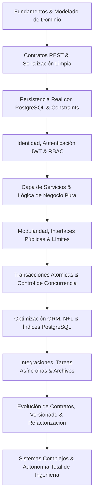

# Mapa de Aprendizaje — 100 Ejercicios de Backend con Django REST Framework y Arquitectura Monolítica Modular

Este mapa conceptual describe la progresión técnica, capacidades de ingeniería, conceptos fundamentales y dependencias pedagógicas a lo largo de los 100 ejercicios.

> **Nota Metodológica:** La progresión no se divide en etiquetas tradicionales simplistas (básico, intermedio, avanzado), sino en una curva continua de complejidad técnica, consistencia transaccional, modularidad arquitectónica, rendimiento y autonomía de diseño.

---

## 1. Dimensiones de Crecimiento del Backend Engineer

---

## 2. Matriz Conceptual y Capacidades por Bloque Pedagógico

### Bloque I: Fundación del Monolito, Modelado de Dominio y Contratos REST (Ejercicios 001 - 015)
* **Objetivo de Ingeniería:** Estructurar un monolito modular desde el día cero, dominar el modelado de datos en PostgreSQL con precisión numérica fija, diseñar contratos REST limpios y separar formalmente HTTP (Vistas), Contratos (Serializers), Negocio (Servicios) y Lecturas (Selectores).
* **Capacidades Adquiridas:**
  - Configuración modular de Django con namespace `apps/`.
  - Modelado de agregados con UUIDs, DecimalField y claves foráneas jerárquicas/N a M con metadata.
  - Creación de contratos REST declarativos con Serializers específicos para lectura vs escritura.
  - Validación en tres capas: sintáctica (Serializer), dominio (Servicios) e integridad física (`CheckConstraint` en PostgreSQL).
  - Desacoplamiento de vistas mediante el patrón Service Layer y Selector Layer.
  - Normalización global de errores HTTP con Custom Exception Handler.

| Ejercicio | Título / Capacidad de Negocio | Conceptos Principales | Módulo Principal |
| :--- | :--- | :--- | :--- |
| **001** | Fundación del Monolito Modular | Apps como módulos de negocio, variables de entorno | `config`, `apps/core` |
| **002** | Modelado de Dominio de Catálogo | UUID, DecimalField, Tipos de datos en PostgreSQL | `apps/catalog` |
| **003** | Contratos REST y Serialización | Serializer vs ModelSerializer, read_only_fields | `apps/catalog` |
| **004** | Validaciones de Formato vs Dominio | `validate_<field>`, `validate()`, regex, errores | `apps/catalog` |
| **005** | Vistas Explícitas con APIView | Ciclo de vida HTTP, verbos semánticos, status codes | `apps/catalog` |
| **006** | Categorías y Relaciones Jerárquicas | `ForeignKey('self')`, `on_delete=models.PROTECT` | `apps/catalog` |
| **007** | Relaciones Many-to-Many con Metadata | `ManyToManyField(through=...)`, tabla intermedia | `apps/catalog` |
| **008** | Restricciones de Integridad en PostgreSQL | `models.CheckConstraint`, `models.Q`, DDL SQL | `apps/catalog` |
| **009** | Migraciones de Esquema y Datos | `migrations.RunPython`, `apps.get_model()`, migraciones seguras | `apps/catalog` |
| **010** | Vistas Genéricas Conscientes | `generics.RetrieveUpdateDestroyAPIView`, `lookup_field` | `apps/catalog` |
| **011** | Paginación y Control de Carga | `PageNumberPagination`, `LIMIT`/`OFFSET`, max_page_size | `apps/core`, `apps/catalog` |
| **012** | Filtrado Declarativo y Búsqueda | `django-filter`, `SearchFilter`, `OrderingFilter` | `apps/catalog` |
| **013** | Capa de Servicios (Service Layer) | Desacoplamiento de lógica de negocio, `services.py` | `apps/catalog` |
| **014** | Capa de Selectores (Selector Layer) | Desacoplamiento de consultas reutilizables, `selectors.py` | `apps/catalog` |
| **015** | Formato de Errores Estandarizado | Custom Exception Handler, normalización `error.code` | `apps/core` |

---

### Bloque II: Identidad, Autenticación JWT, Seguridad y Ownership (Ejercicios 016 - 030)
* **Objetivo de Ingeniería:** Implementar autenticación stateless mediante JWT, rotación y listas negras de tokens, desacoplar credenciales técnicas de perfiles comerciales, prevenir vulnerabilidades IDOR/BOLA mediante verificación estricta de Ownership y construir suites de pruebas automatizadas con `pytest`.
* **Capacidades Adquiridas:**
  - Custom User Model basado en correo electrónico con hashing PBKDF2/Argon2.
  - Flujos completos de emisión, refresco, rotación y revocación (Blacklisting) de JWTs.
  - Desacoplamiento de identidad (`apps/users`) y perfil comercial (`apps/customers`).
  - Prevención de OWASP API Top 1 (BOLA/IDOR) con permisos de propietario y filtrado de QuerySets.
  - Implementación de control de acceso basado en roles (RBAC) declarativo.
  - Protección contra abusos y fuerza bruta mediante Throttling / Rate Limiting.
  - Pruebas automatizadas de seguridad e integración con `pytest-django`.

| Ejercicio | Título / Capacidad de Negocio | Conceptos Principales | Módulo Principal |
| :--- | :--- | :--- | :--- |
| **016** | Modelo de Usuario Personalizado | `AbstractBaseUser`, `BaseUserManager`, UUID PK | `apps/users` |
| **017** | Registro y Validación Criptográfica | `validate_password`, `AUTH_PASSWORD_VALIDATORS` | `apps/users` |
| **018** | Autenticación con JWT | SimpleJWT, claims personalizados, login stateless | `apps/users` |
| **019** | Rotación y Revocación de Tokens | `TokenRefreshView`, `TokenBlacklistView`, logout | `apps/users` |
| **020** | Protección de Endpoints | `IsAuthenticatedOrReadOnly`, cabeceras Bearer | `apps/catalog` |
| **021** | Módulo de Clientes y Perfil 1 a 1 | Desacoplamiento de identidad vs perfil comercial | `apps/customers` |
| **022** | Verificación de Ownership (IsOwner) | Prevención de BOLA/IDOR, permisos a nivel de objeto | `apps/customers` |
| **023** | Control de Acceso por Roles (RBAC) | `TextChoices` de roles, `HasRole`, centralización | `apps/users` |
| **024** | Permisos Dinámicos por Estado | Permisos contextuales combinando rol y estado | `apps/catalog` |
| **025** | Configuración Segura de Entorno | `django-environ`, 12-Factor App, `.env` | `config` |
| **026** | Throttling y Rate Limiting | `SimpleRateThrottle`, protección brute force (429) | `apps/core`, `apps/users` |
| **027** | Recuperación de Contraseña Segura | `PasswordResetTokenGenerator`, HMAC, anti-enumeración | `apps/users` |
| **028** | Auditoría y Trazabilidad de Negocio | Ledger inmutable de eventos, `apps/audit` | `apps/audit` |
| **029** | Soft Delete vs Eliminación Física | Desactivación de cuentas, preservación histórica | `apps/users` |
| **030** | Testing Automatizado de Seguridad | `pytest-django`, fixtures, parametrización de roles | `tests/` |

---

### Bloque III: Dominio Complejo, Consistencia Transaccional y Concurrencia (Ejercicios 031 - 045)
* **Objetivo de Ingeniería:** Modelar operaciones comerciales completas (pedidos, reservas de inventario, promociones y cupones), garantizar inmutabilidad histórica contable, orquestar múltiples módulos bajo transacciones atómicas y dominar el control de concurrencia pesimista (`select_for_update`) en PostgreSQL.
* **Capacidades Adquiridas:**
  - Bounded Context de Pedidos (`apps/orders`) con snapshots inmutables de precios y direcciones.
  - Coordinación transaccional ACID (`transaction.atomic`) entre Órdenes e Inventario.
  - Máquinas de estados finitas (FSM) y endpoints de acción semánticos (`/cancel/`, `/pay/`).
  - Creación de jerarquías de excepciones de dominio desacopladas del protocolo HTTP.
  - Prevención de condiciones de carrera y sobreventa mediante bloqueo pesimista en PostgreSQL.
  - Soporte de idempotencia en peticiones HTTP con cabecera `Idempotency-Key`.
  - Automatización con Custom Management Commands y tests de rollback transaccional.

| Ejercicio | Título / Capacidad de Negocio | Conceptos Principales | Módulo Principal |
| :--- | :--- | :--- | :--- |
| **031** | Módulo de Pedidos y Bounded Context | Agregados, número correlativo, snapshots inmutables | `apps/orders` |
| **032** | Líneas de Pedido e Inmutabilidad | `OrderItem`, copiado de precio histórico, `on_delete=PROTECT` | `apps/orders` |
| **033** | Interfaces Públicas Inter-Módulo | `orders.services.create_order` consumiendo `catalog` | `apps/orders` |
| **034** | Transacciones Atómicas (Todo o Nada) | `transaction.atomic()`, prevención de datos huérfanos | `apps/orders` |
| **035** | Módulo de Inventario y Movimientos | Stock físico vs reservado, Ledger de inventario | `apps/inventory` |
| **036** | Coordinación Transaccional de Stock | Descuento atómico de existencias al crear pedido | `apps/orders`, `apps/inventory` |
| **037** | Máquina de Estados del Pedido | Grafo de transiciones válidas, bloqueo de mutaciones | `apps/orders` |
| **038** | Endpoints de Acción de Negocio | `POST /orders/{id}/cancel/`, liberación de stock | `apps/orders` |
| **039** | Jerarquía de Excepciones de Dominio | `DomainError` agnóstico a HTTP, mapeo en handler | `apps/core`, `apps/orders` |
| **040** | Bloqueo Pesimista en Concurrencia | `select_for_update()`, prevención de Race Conditions | `apps/inventory` |
| **041** | Promociones y Validación de Cupones | Cupones, caducidad, límite de usos por usuario | `apps/promotions` |
| **042** | Idempotencia y Prevención de Cobro Doble | Cabecera `Idempotency-Key`, almacenamiento de respuestas | `apps/core`, `apps/orders` |
| **043** | Django Admin Operativo | `TabularInline`, `readonly_fields`, `list_select_related` | `apps/orders`, `apps/inventory` |
| **044** | Comando CLI para Cancelar Expirados | `BaseCommand`, `--dry-run`, procesamiento por lotes | `apps/orders` |
| **045** | Pruebas de Integración y Rollback | Validación de consistencia ante fallos en cascada | `tests/integration/` |

---

### Bloque IV: Pagos, Integraciones, Archivos y Documentación OpenAPI (Ejercicios 046 - 060)
* **Objetivo de Ingeniería:** Integrar pasarelas de pago desacopladas mediante el patrón Adapter, procesar Webhooks con verificación criptográfica HMAC, gestionar notificaciones y tareas en background, cargar y validar archivos binarios de forma segura y generar especificaciones OpenAPI 3.0.
* **Capacidades Adquiridas:**
  - Aislamiento de proveedores externos mediante el patrón Gateway / Adapter.
  - Recepción segura e idempotente de Webhooks con verificación de firma HMAC-SHA256.
  - Desacoplamiento de eventos de comunicación en el módulo `apps/notifications`.
  - Procesamiento asíncrono y tareas no bloqueantes con `transaction.on_commit`.
  - Validación de subida de archivos mediante inspección de Magic Bytes (tipos MIME reales).
  - Streaming de archivos pesados (CSV/PDF) con consumo de memoria O(1).
  - Descarga segura de archivos privados mediante URLs firmadas y endpoints autorizados.
  - Inicialización programática de datos (Database Seeding) y generación de OpenAPI 3.0 con `drf-spectacular`.

| Ejercicio | Título / Capacidad de Negocio | Conceptos Principales | Módulo Principal |
| :--- | :--- | :--- | :--- |
| **046** | Módulo de Pagos e Intentos de Cobro | `PaymentTransaction`, estados de pago, PCI-DSS | `apps/payments` |
| **047** | Aislamiento con Patrón Gateway | `PaymentGatewayInterface`, adaptadores simulados | `apps/payments` |
| **048** | Webhooks y Firmas Criptográficas | Verificación HMAC-SHA256, `hmac.compare_digest` | `apps/payments` |
| **049** | Módulo de Notificaciones In-App | Bandeja de avisos, badge de no leídas, PubSub | `apps/notifications` |
| **050** | Tareas Asíncronas en Background | Emails no bloqueantes, `transaction.on_commit` | `apps/core`, `apps/notifications` |
| **051** | Facturación y Validación de Archivos | Magic Bytes, tamaño máximo, sanitización de uploads | `apps/billing` |
| **052** | Generación de Reportes en Streaming | `StreamingHttpResponse`, generadores `yield`, CSV | `apps/billing` |
| **053** | Descarga Segura de Archivos Privados | URLs firmadas, `TimestampSigner`, `FileResponse` | `apps/billing` |
| **054** | Datos Iniciales y Seeds Programáticos | Comando `seed_demo_data`, datos reproducibles | `apps/core` |
| **055** | Envíos, Logística y Tracking | Transportistas, guías de despacho, sincronización | `apps/shipping` |
| **056** | Refactorización: Vistas a Servicios | Reducción de complejidad ciclomática, Skinny Views | Todos los módulos |
| **057** | Refactorización: Imports Circulares | Grafo Acíclico Dirigido (DAG), inversión de dependencias | `apps/orders`, `apps/payments` |
| **058** | Configuración Dinámica de Negocio | Parámetros en DB con caché en memoria, Feature Flags | `apps/business_settings` |
| **059** | Health Checks (Liveness y Readiness) | `/api/health/ready/`, verificación activa de DB | `apps/core` |
| **060** | Documentación OpenAPI / Swagger | `drf-spectacular`, OpenAPI 3.0, `@extend_schema` | `config` |

---

### Bloque V: Rendimiento Extremo, PostgreSQL Avanzado y Observabilidad (Ejercicios 061 - 075)
* **Objetivo de Ingeniería:** Diagnosticar y resolver problemas de rendimiento N+1, construir consultas analíticas avanzadas en PostgreSQL, implementar índices compuestos y parciales, búsqueda Full-Text nativa, logging estructurado JSON, control de concurrencia optimista y settings multientorno.
* **Capacidades Adquiridas:**
  - Detección sistemática y eliminación de problemas N+1 con `select_related` y `Prefetch`.
  - Agregaciones y subconsultas correlacionadas complejas (`Subquery`, `Exists`, `Coalesce`).
  - Diseño estratégico de índices en PostgreSQL (B-Tree, Parciales, GIN).
  - Búsqueda de texto completo (Full-Text Search) con `SearchVector`, `SearchQuery` y `SearchHeadline`.
  - Almacenamiento y consultas sobre estructuras semiestructuradas con `JSONField` (JSONB).
  - Optimización de transporte de columnas con `only()`, `defer()` y `values()`.
  - Logging estructurado en formato JSON (NDJSON) con inyección de `request_id`.
  - Endurecimiento de seguridad contra OWASP API Top 10 y versionado de contratos `/api/v1/` vs `/api/v2/`.
  - Concurrencia optimista con `version_id` y pruebas automáticas de presupuesto de queries SQL.

| Ejercicio | Título / Capacidad de Negocio | Conceptos Principales | Módulo Principal |
| :--- | :--- | :--- | :--- |
| **061** | Diagnóstico del Problema N+1 | `CaptureQueriesContext`, profiling de consultas | `apps/orders` |
| **062** | Optimización con select_related y Prefetch | Consultas O(1), `Prefetch` con filtrado personalizado | `apps/orders` |
| **063** | Consultas Agregadas y Subqueries | `annotate`, `Count`, `Sum`, `Max`, `Subquery`, `Exists` | `apps/customers` |
| **064** | Índices Compuestos y Parciales en PostgreSQL | `Index(condition=Q(...))`, EXPLAIN ANALYZE | `apps/catalog`, `apps/orders` |
| **065** | Búsqueda Full-Text en PostgreSQL | `SearchVector`, `SearchQuery`, `SearchRank`, FTS | `apps/catalog` |
| **066** | Campos JSONB y Datos Semiestructurados | `JSONField`, operadores `->>`, índice GIN | `apps/catalog` |
| **067** | Optimización de Memoria con only()/defer() | Reducción de payload SQL, `values_list(flat=True)` | `apps/catalog` |
| **068** | Logging Estructurado JSON en Producción | Formato NDJSON, `request_id`, sanitización de logs | `config`, `apps/core` |
| **069** | Seguridad Avanzada y OWASP Top 10 API | Prevención de Mass Assignment y Parameter Tampering | Todos los módulos |
| **070** | Versionado de APIs (/api/v1/ vs /api/v2/) | `URLPathVersioning`, evolución de contratos sin duplicar DB | `config`, `apps/catalog` |
| **071** | Transición Suave y Sunset Headers | Cabeceras HTTP `Deprecation` y `Sunset` (RFC 8594) | `apps/core` |
| **072** | Estrategias de Caché e Invalidación | Patrón Cache-Aside, invalidación granular en servicios | `apps/catalog` |
| **073** | Concurrencia Optimista (version_id) | Prevención de Lost Updates, expresiones `F()`, 409 Conflict | `apps/catalog` |
| **074** | Tests de Presupuesto de Queries SQL | `@assert_max_queries`, prevención de regresiones en CI | `tests/` |
| **075** | Settings Modulares Multientorno | `base.py`, `development.py`, `testing.py`, `production.py` | `config/settings/` |

---

### Bloque VI: Sistemas Evolutivos, Operaciones y Contenerización (Ejercicios 076 - 090)
* **Objetivo de Ingeniería:** Gestionar la evolución de un monolito modular con más de 10 aplicaciones, implementar dominios complejos (devoluciones, suscripciones recurrentes, inventario multisede, soporte con SLAs, reseñas verificadas), contenerizar con Docker Compose y desacoplar con Eventos de Dominio.
* **Capacidades Adquiridas:**
  - Auditoría de cohesión y acoplamiento en sistemas empresariales de gran escala.
  - Orquestación multi-módulo (Devoluciones -> Inventario + Pagos + Notificaciones).
  - Motores de suscripción periódica y facturación recurrente desatendida.
  - Gestión de inventario distribuido multisede y transferencias físicas en tránsito.
  - Sistema de tickets de atención con hilos conversacionales y notas internas.
  - Reseñas con verificación obligatoria de compra y métricas agregadas en tiempo real.
  - Contenerización profesional con Dockerfile multi-stage, usuarios no root y volúmenes en Windows/Linux.
  - Migraciones de bases de datos complejas sin tiempo de inactividad (Expand and Contract).
  - Desacoplamiento arquitectónico mediante Bus de Eventos de Dominio internos.

| Ejercicio | Título / Capacidad de Negocio | Conceptos Principales | Módulo Principal |
| :--- | :--- | :--- | :--- |
| **076** | Auditoría de Cohesión y Acoplamiento | Límites modulares, interfaces públicas estrictas | Todas las apps |
| **077** | Módulo de Devoluciones y Reembolsos | `ReturnRequest`, garantías temporales, `apps/returns` | `apps/returns` |
| **078** | Coordinación Multi-Módulo de Devoluciones | Orquestación atómica: `returns` -> `inventory` + `payments` | `apps/returns` |
| **079** | Sistema de Suscripciones Periódicas | Planes SaaS, ciclos de renovación, estados de membresía | `apps/subscriptions` |
| **080** | Facturación Recurrente Automática | Motor de renovación periódica, Dunning, periodos de gracia | `apps/subscriptions` |
| **081** | Inventario Multisede y Sucursales | Stock distribuido por tienda física, `apps/branches` | `apps/branches`, `apps/inventory` |
| **082** | Transferencias de Stock entre Sucursales | Mercancía en tránsito, confirmación en destino | `apps/inventory` |
| **083** | Sistema de Soporte y Tickets de Atención | Hilos de mensajes, notas internas privadas, `apps/support` | `apps/support` |
| **084** | Asignación de Agentes y Escalado de SLAs | RBAC jerárquico de soporte, auditoría de asignación | `apps/support` |
| **085** | Reseñas con Compra Verificada | `Verified Purchase`, prevención de spam, `apps/reviews` | `apps/reviews` |
| **086** | Actualización Atómica de Calificaciones | Desnormalización controlada, promedio de estrellas O(1) | `apps/reviews`, `apps/catalog` |
| **087** | Dockerización Profesional del Monolito | Dockerfile multistage, `docker-compose.yml`, PostgreSQL | Raíz del proyecto |
| **088** | Gestión Segura de Secretos en Docker | Docker Secrets, variables en memoria, hardening | `config`, Docker |
| **089** | Migraciones Complejas sin Downtime | Patrón Expand and Contract, Dual Writing, Backfill | `apps/customers` |
| **090** | Desacoplamiento con Eventos de Dominio | Bus de Eventos interno, PubSub tipado, inmutabilidad | `apps/core`, todas las apps |

---

### Bloque VII: Autonomía Senior y Desafíos de Arquitectura Capstone (Ejercicios 091 - 100)
* **Objetivo de Ingeniería:** Enfrentar problemas de negocio de alta complejidad técnica sin estructuras predefinidas. El practicante debe diseñar autónomamente el modelado de datos, transacciones, restricciones físicas en PostgreSQL, capas de servicio, contratos REST y pruebas automatizadas.
* **Capacidades Adquiridas:**
  - Diseño de sistemas de alta contención y concurrencia (Subastas en tiempo real).
  - Plataformas corporativas B2B con jerarquías y presupuestos departamentales.
  - Agendamiento clínico con exclusión matemática de solapamientos temporales (`btree_gist`).
  - Gestión de flotas y logística de rutas multiparada con control de capacidad.
  - Plataformas de educación LMS con grafos de prerrequisitos y certificación digital.
  - Billeteras FinTech con Contabilidad de Doble Entrada (Ledger) y cero saldos negativos.
  - Alquileres con depósitos de garantía en custodia (Escrow) e inspecciones físicas.
  - Redes de comisiones de afiliados multinivel con retenciones fiscales automáticas.
  - Gestión de incidentes de seguridad con cadenas de hashes forenses inmutables.
  - Capstone Final: Plataforma omnicanal completa integrada, probada y desplegada.

| Ejercicio | Título / Capacidad de Negocio | Conceptos Clave de Dominio | Nivel de Orientación |
| :--- | :--- | :--- | :--- |
| **091** | Subastas en Tiempo Real y Cierre Atómico | Concurrencia pesimista, Anti-Sniping, adjudicación | **Autónomo** |
| **092** | Compras B2B con Aprobación Jerárquica | Presupuestos departamentales, umbrales de firma multinivel | **Autónomo** |
| **093** | Citas Médicas y Control de Solapamientos | `ExclusionConstraint`, tipos de rango `tstzrange`, PostgreSQL GiST | **Autónomo** |
| **094** | Gestión de Flotas y Rutas Multiparada | Restricciones de capacidad (peso/volumen), secuencias de parada | **Autónomo** |
| **095** | E-Learning con Prerrequisitos y Diplomas | Grafos acíclicos, progreso dinámico, diplomas con verificación pública | **Autónomo** |
| **096** | Billetera FinTech con Doble Entrada | Double-Entry Ledger, débitos/créditos balanceados, cero saldos negativos | **Autónomo** |
| **097** | Alquileres con Depósito en Custodia | Escrow, preautorización de pagos, liquidación post-inspección | **Autónomo** |
| **098** | Afiliados Multinivel y Liquidación Fiscal | Red de referidos, comisiones escalonadas, retención de impuestos | **Autónomo** |
| **099** | Incidentes con Registro Forense Inmutable | Sellado criptográfico encadenado (Hash Chaining), SLAs de SOC | **Autónomo** |
| **100** | El Gran Desafío: Plataforma Omnicanal | Consolidación holística de 10+ módulos, Docker, OpenAPI v3, 100% tests | **Autonomía Total** |

---

## 3. Guía de Autoevaluación y Madurez Técnica

Al completar los 100 ejercicios, el desarrollador backend debe ser capaz de defender técnicamente cada una de las siguientes preguntas en cualquier entrevista técnica senior o revisión de diseño de sistema (System Design Review):

1. **Ubicación de Responsabilidades:** ¿Por qué esta regla de negocio vive en un servicio y no en un serializer, vista o señal de Django?
2. **Consistencia de Datos:** ¿Qué ocurre si la base de datos o la pasarela falla a mitad de la operación y cómo garantizo que no queden datos corruptos?
3. **Eficiencia en PostgreSQL:** ¿Cuántas consultas SQL ejecuta este endpoint, qué índices utiliza y por qué está protegido contra el problema N+1?
4. **Seguridad Defensiva:** ¿Cómo garantiza la API que ningún usuario pueda ver o modificar recursos de otro simplemente alterando un UUID en la URL?
5. **Evolución sin Deuda:** ¿Cómo permite la arquitectura agregar una nueva capacidad de negocio sin tener que reescribir ni romper los módulos existentes?
