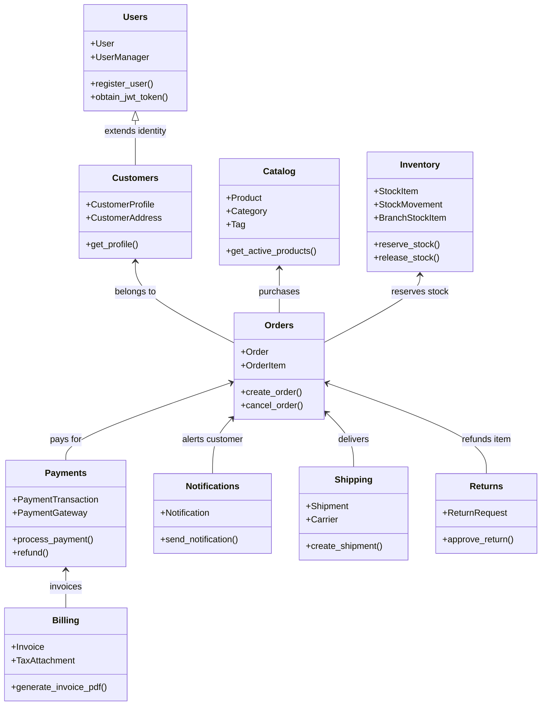

# Mapa de Arquitectura — Evolución del Monolito Modular con Django REST Framework

Este documento describe formalmente la arquitectura de software, los límites de dominio (Bounded Contexts), las responsabilidades de cada módulo, la matriz de dependencias permitidas y los contratos de comunicación interna del sistema backend.

---

## 1. Visión Arquitectónica General

El sistema se diseña y despliega como una **única unidad desplegable (Monolito)**, pero internamente se estructura de forma estrictamente **Modular**. Cada capacidad del negocio reside en un paquete independiente dentro de `apps/`, encapsulando sus propios modelos, serializers, vistas, servicios y selectores.

```text
backend/
├── config/                          # Orquestación global, settings modulares y URLs raíz
│   ├── settings/
│   │   ├── base.py                 # Configuración universal
│   │   ├── development.py          # Entorno local
│   │   ├── testing.py              # Entorno de pruebas acelerado
│   │   └── production.py           # Entorno de producción seguro
│   ├── urls.py                     # Enrutamiento de namespaces (/api/v1/, /api/v2/)
│   ├── wsgi.py
│   └── asgi.py
│
├── apps/                            # Módulos de dominio de negocio autónomos
│   ├── core/                       # Utilidades transversales agnósticas al negocio
│   ├── users/                      # Identidad, autenticación JWT, RBAC y credenciales
│   ├── customers/                  # Perfiles de clientes comerciales y direcciones
│   ├── catalog/                    # Productos, categorías, tags, atributos y precios
│   ├── inventory/                  # Existencias físicas, reservas, multisede y movimientos
│   ├── orders/                     # Creación de pedidos, snapshots inmutables y estados
│   ├── payments/                   # Transacciones de cobro, pasarelas y webhooks
│   ├── billing/                    # Facturas electrónicas, reportes y gestión de archivos
│   ├── shipping/                   # Despachos, transportistas y números de guía
│   ├── promotions/                 # Cupones de descuento y reglas promocionales
│   ├── returns/                    # Devoluciones, garantías y liquidación de reembolsos
│   ├── subscriptions/              # Membresías SaaS y facturación recurrente automática
│   ├── branches/                   # Sucursales físicas y geolocalización
│   ├── support/                    # Helpdesk, tickets de atención, hilos y SLAs
│   ├── reviews/                    # Reseñas con compra verificada y métricas agregadas
│   ├── affiliates/                 # Red de afiliados multinivel y liquidación fiscal
│   └── security_incidents/         # Gestión de incidentes con bitácora forense inmutable
│
├── tests/                           # Suite de pruebas de integración y rendimiento
│   ├── conftest.py                 # Fixtures globales de pytest
│   ├── integration/                # Pruebas de flujos multi-módulo
│   └── utils.py                    # Aserciones de presupuesto de queries
│
├── manage.py
├── Dockerfile
├── docker-compose.yml
└── requirements.txt
```

---

## 2. Anatomía Interna de un Módulo de Dominio

Cada módulo dentro de `apps/<module_name>/` sigue una estructura de capas predecible:

```text
apps/<module_name>/
├── __init__.py
├── apps.py                  # AppConfig con namespace 'apps.<module_name>'
├── models.py                # Entidades y persistencia en PostgreSQL (privadas al módulo)
├── serializers.py           # Contratos de entrada/salida (DTOs / JSON)
├── views.py                 # Adaptadores HTTP delegadores (Skinny Views)
├── urls.py                  # Rutas locales del módulo
├── services.py              # Operaciones de escritura, transacciones y reglas del negocio
├── selectors.py             # Operaciones de lectura y consultas optimizadas
├── permissions.py           # Clases de autorización y control de ownership
├── filters.py               # Filtros declarativos (django-filter)
├── exceptions.py            # Excepciones de dominio personalizadas
└── tests/                   # Pruebas unitarias y de servicios del módulo
```

---

## 3. Responsabilidades y Límites de Cada Módulo



---

## 4. Matriz de Dependencias Permitidas (Grafo Acíclico Dirigido)

Para mantener bajo acoplamiento y evitar dependencias circulares, los módulos deben respetar estrictamente la siguiente matriz de comunicación:

| Módulo | Puede Depender de (Consumir Servicios de) | NO Puede Depender de |
| :--- | :--- | :--- |
| **`apps/core`** | *Ninguno (totalmente agnóstico)* | Cualquier módulo de `apps/` |
| **`apps/users`** | `apps/core`, `apps/audit` | `catalog`, `orders`, `payments`, `customers` |
| **`apps/customers`** | `apps/core`, `apps/users` (identidad) | `orders`, `payments`, `catalog` |
| **`apps/catalog`** | `apps/core`, `apps/users` (permisos) | `orders`, `payments`, `inventory` |
| **`apps/inventory`** | `apps/core`, `apps/branches` | `orders`, `payments`, `shipping` |
| **`apps/promotions`** | `apps/core`, `apps/customers` | `orders`, `payments` |
| **`apps/orders`** | `core`, `customers`, `catalog`, `inventory`, `promotions` | `payments`, `shipping`, `returns` |
| **`apps/payments`** | `core`, `orders` (selectors), `users` | `inventory`, `shipping`, `catalog` |
| **`apps/notifications`**| `core`, `users` | `orders`, `payments`, `catalog` |
| **`apps/billing`** | `core`, `orders`, `customers`, `payments` | `inventory`, `catalog` |
| **`apps/shipping`** | `core`, `orders`, `notifications` | `payments`, `catalog`, `billing` |
| **`apps/returns`** | `core`, `orders`, `inventory`, `payments`, `notifications` | `shipping`, `subscriptions` |
| **`apps/subscriptions`**| `core`, `customers`, `payments`, `notifications` | `orders`, `shipping`, `inventory` |
| **`apps/support`** | `core`, `users`, `customers`, `orders` | `payments`, `inventory`, `catalog` |
| **`apps/reviews`** | `core`, `catalog`, `orders`, `customers` | `payments`, `shipping` |
| **`apps/affiliates`** | `core`, `users`, `orders`, `billing` | `inventory`, `shipping` |
| **`apps/security_incidents`**| `core`, `users`, `audit` | `catalog`, `orders`, `inventory` |

---

## 5. Reglas de Comunicación Inter-Módulo

1. **Invocación a través de Servicios Públicos:** Si `apps/orders` necesita verificar stock, invoca `apps.inventory.services.reserve_stock(...)`. NUNCA hace `from apps.inventory.models import StockItem; StockItem.objects.filter(...).update(...)`.
2. **Consultas a través de Selectores Públicos:** Si `apps/orders` necesita datos de productos, invoca `apps.catalog.selectors.get_active_products_by_ids(...)`.
3. **Referencias de Persistencia Desacopladas:** En modelos relacionales, las claves foráneas hacia otros módulos deben usar strings (`'customers.CustomerProfile'`, `'catalog.Product'`) con políticas `on_delete=models.PROTECT` para evitar eliminaciones accidentales en cascada entre límites de dominio.
4. **Desacoplamiento por Eventos de Dominio:** Para efectos secundarios no bloqueantes (enviar email de confirmación, registrar analítica, actualizar comisiones), los módulos emiten eventos de dominio inmutables (`OrderCreatedEvent`, `PaymentCapturedEvent`) suscritos por los módulos interesados sin acoplamiento directo.

---

## 6. Registro de Decisiones Arquitectónicas (ADR Log)

A lo largo del proyecto, cada decisión técnica importante se documenta formalmente bajo la estructura:
* **ADR 001:** Adopción de Arquitectura Monolítica Modular sobre Microservicios Prematuros.
* **ADR 002:** Custom User Model con UUID y Autenticación por Correo Electrónico.
* **ADR 003:** Separación explícita de Capa de Servicios (`services.py`) y Capa de Selectores (`selectors.py`).
* **ADR 004:** Control de Concurrencia Pesimista con `select_for_update` en Reserva de Inventario.
* **ADR 005:** Patrón Adapter para Pasarelas de Pago Externas.
* **ADR 006:** Inmutabilidad Contable mediante Libro Mayor de Doble Entrada (Double-Entry Ledger).
* **ADR 007:** Desacoplamiento de Efectos Secundarios mediante Bus de Eventos de Dominio Interno.
